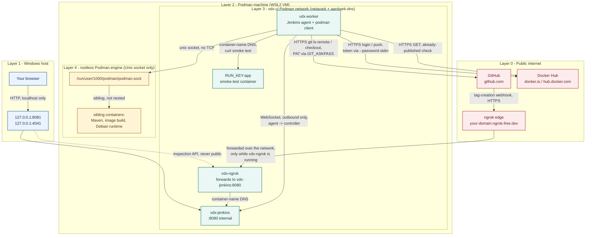

# Networking Overview

Every network path in this pipeline, why it exists, and what is exposed when. Related: [security-notes.md](security-notes.md) · [README](../../README.md).

## Layers



| Layer | What | Who |
| --- | --- | --- |
| 0 | Public internet | GitHub, Docker Hub, ngrok edge |
| 1 | Windows loopback | Browser, published ports |
| 2 | Podman machine (WSL2 VM) | Everything below |
| 3 | `vdx-ci` Podman network (created by `jenkins-env.sh`) | `vdx-jenkins`, `vdx-worker`, `vdx-ngrok`, smoke-test app |
| 4 | Rootless Podman engine, Unix socket | Sibling containers (Maven, image build, Debian runtime) — not Docker-in-Docker |

## Layer 1 → 2: host to VM

- Ports published as `127.0.0.1:<p>` inside the VM are forwarded to the same loopback port on Windows.
- Nothing binds `0.0.0.0` → unreachable from the LAN.

## Layer 3: `vdx-ci`

- Gives **container-name DNS** (`vdx-jenkins:8080`, `${RUN_KEY}-app:8080`) — names resolve only from containers on `vdx-ci`.

| Container | Why on `vdx-ci` |
| --- | --- |
| `vdx-jenkins` | Reachable by name from worker and ngrok |
| `vdx-worker` | Reaches controller; `curl`s smoke-test app |
| `vdx-ngrok` (demo only) | Forwards tunnel to `vdx-jenkins:8080` |
| `RUN_KEY-app` (transient) | `--network vdx-ci` in `Smoke Test`; never published to a host port |

- **Not** on `vdx-ci`: Maven containers (`Validate Ancestry and Version`, `Compile and Test`) — default network; need only Maven Central + shared volumes (mounts, not network).

## Agent → controller

- `vdx-worker` uses **WebSocket** (`-webSocket` in `jenkins-env.sh agent`), outbound only.
- `casc/jenkins.yaml` sets `slaveAgentPort: -1` → inbound TCP `50000` disabled.

## Layer 4: Podman socket

- Worker gets `CONTAINER_HOST=unix:///run/podman/podman.sock` + the host rootless socket bind-mounted.
- `Dockerfile.worker` installs the Podman **remote client** only → `podman --remote …` starts **siblings** on the one host engine.
- Unix socket, not TCP: never on `vdx-ci`; only `vdx-worker` has it.
- A sibling needing name access from the worker (smoke-test app) must be put on `vdx-ci` explicitly.

## Outbound (all HTTPS, from `vdx-worker`)

| Call | Stage | Auth |
| --- | --- | --- |
| `git ls-remote --tags` app repo | Discover Release Tag | PAT via `GIT_ASKPASS` |
| `GitSCM` checkout at exact tag | Checkout Exact Tag | credential `github-java-maven-sample-app-pat` |
| `hub.docker.com/v2/repositories/.../tags/<tag>/` | Discover Release Tag | none (public) — skips already-published tags |
| `podman --remote login` / `push` | Publish to Registry | `--password-stdin`, `EXIT` trap logout |
| Maven Central | Compile and Test / Validate | none; cached in `vdx-maven-cache` |

## Inbound webhook (only inbound path)

```
GitHub tag-creation event
  -> POST https://<domain>.ngrok-free.dev/generic-webhook-trigger/invoke?token=vdx-release-trigger
  -> ngrok edge -> vdx-ngrok (on vdx-ci, no host port) -> vdx-jenkins:8080
  -> Generic Webhook Trigger validates token -> starts vdx-release
```

- Inspection API (host `127.0.0.1:4041` → container `4040`) ≠ tunnel; loopback only, never public.
- Domain is stable; the tunnel is not → failed deliveries while `vdx-ngrok` is stopped are expected.
- Leaked token → extra build only ([security-notes.md](security-notes.md#webhook-trust)).
- No `vdx-ngrok` → no public listener at all.

## Ports

| Port | Bound to | Reachable from | When |
| --- | --- | --- | --- |
| `8081` → `8080` | `127.0.0.1` | this machine | `vdx-jenkins` running |
| `4041` → `4040` | `127.0.0.1` | this machine | `vdx-ngrok` running |
| `8080` in `vdx-ci` | container network | worker, ngrok | `vdx-jenkins` running |
| ngrok public URL | internet | anyone, until token check rejects | `vdx-ngrok` running |
| `50000` | disabled | nobody | never |
| Podman socket | Unix file | `vdx-worker` only | worker up |

## Reviewer Q&A

- **Why WebSocket?** Worker-initiated, outbound-only; avoids opening `50000`.
- **Why isn't the smoke-test app published?** Only the worker curls it, over `vdx-ci`; publishing adds exposure for no purpose.
- **Jenkins reachable without ngrok?** No — `127.0.0.1` only.
- **Docker-in-Docker?** No — remote client + host rootless engine, siblings.
- **Name collisions?** Names are fixed; `jenkins-env.sh` labels resources (`vdx.owner`) and refuses to touch same-named ones it doesn't own.
- **Production changes?** Credential-backed webhook secret, TLS in front of Jenkins, dedicated build engine/account — see [security-notes.md](security-notes.md).
