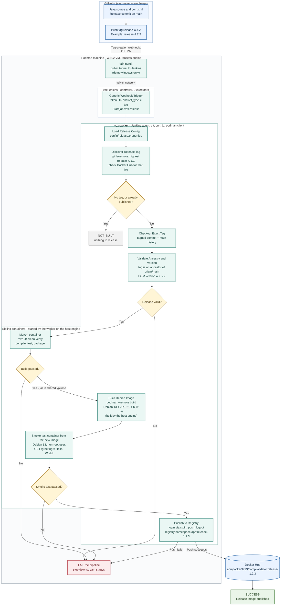

# Pipeline Design

Implemented in [../../Jenkinsfile](../../Jenkinsfile). Diagram exports: [png](pipeline-flow.png) · [svg](pipeline-flow.svg).

**Trigger:** creating a `release-X.Y.Z` **tag** on GitHub. No GitHub Release needed; a local-only tag doesn't trigger.

## Flow

- Grey box = skipped run (`NOT_BUILT`): no unpublished `release-*` tag, or that version is already on Docker Hub. It is a clean outcome, not a failure.
- The worker (`vdx-worker`) runs every pipeline step. Maven and the smoke test run in **sibling containers** it starts on the host engine through the mounted Podman socket; the image build is executed by the host engine itself.
- "Smoke test passed?" = the image is Debian 13, runs as a non-root user and `/greeting` returns `Hello, World!`. All checks are implemented, not optional.
- Any checkout / validation / Maven / build / smoke-test / push error fails the run and skips every later stage.
- Setup and teardown (`one-touch.sh`) are not part of this diagram; see [code-tour.md](code-tour.md).
- Out of scope: production deployment; the endpoint is a published image.

## Requirements → design

| Requirement | Decision |
| --- | --- |
| Code in GitHub | Fetch from the release tag |
| Release from `master` triggers Jenkins | Tag-creation event; tagged commit must be reachable from `origin/main` (the repo's default branch; the brief says `master`) |
| Compile, package only on success | Check out tagged commit → build → gate packaging |
| Binaries in a container | Git, curl, jq in the worker container; JDK and Maven in a disposable sibling container (`maven:3.9.9-eclipse-temurin-17`) |
| Jenkins as container | Controller container (`vdx-jenkins`) and worker container (`vdx-worker`); sibling containers for tooling |
| Debian 13 image | Debian 13 + compatible Java runtime + built artifact |
| Push with same release tag | `registry/namespace/app:release-1.2.3` — keep `release-` prefix |
| Tag `release-1.2.3` = POM version | Validate against effective Maven version before building |

## Design assumptions

- **"From master":** tag must be reachable from the main branch (not necessarily its tip). Always build the tagged SHA, never the latest branch head. The brief says `master`; the app repo's default branch is `main`, so the implementation checks `origin/main` (`ANCESTRY_REF` in `config/release.properties`). The diagram uses `main`.
- **Empty host:** no host-installed Jenkins, Git, JDK, Maven or image client. OS, container runtime, storage, networking are unavoidable.
- **Maven:** read the *effective* POM version (inherited / property-based). `1.2.3` must match `release-1.2.3`; `1.2.3-SNAPSHOT` must **not** become `1.2.3`. Reject mismatches; never edit the POM in a release build.
- **Container boundary:** explicit workspace/artifact handoff. Final image needs the runtime, not Maven or the compile JDK; runtime must support the build's Java target.
- **Tooling:** Java / Maven / Jenkins versions, image builder, registry are implementation choices. No privileged containers and no Docker socket; the one exception is that the worker mounts the host's **rootless Podman socket** to start sibling containers (see [security-notes.md](security-notes.md#rootless-podman-socket)).

## Safeguards

Implemented:
- Webhook supports tag creation; a static token authenticates it; events that are not tags are filtered out. The job never uses the payload's repo or tag: it always reads `APP_REPO_URL` and re-derives the tag itself. No separate GitHub Release trigger.
- `mvn -B clean verify`; image OS, non-root user and `/greeting` are checked before publish; any failing check fails the run.
- Registry credentials in Jenkins credentials only — never committed or baked in. Publish only after all stages pass.
- Base images (Jenkins, agent, Maven, Debian) pinned by digest at setup; duplicate publication prevented by the registry check and `disableConcurrentBuilds`.
- Archived per run: POM version, image ID, smoke-test response, test reports.

Recommended, not implemented (see [security-notes.md](security-notes.md#known-limitations-and-next-steps)): HMAC webhook verification, protected release tags, recording the source SHA and image digest per release.
